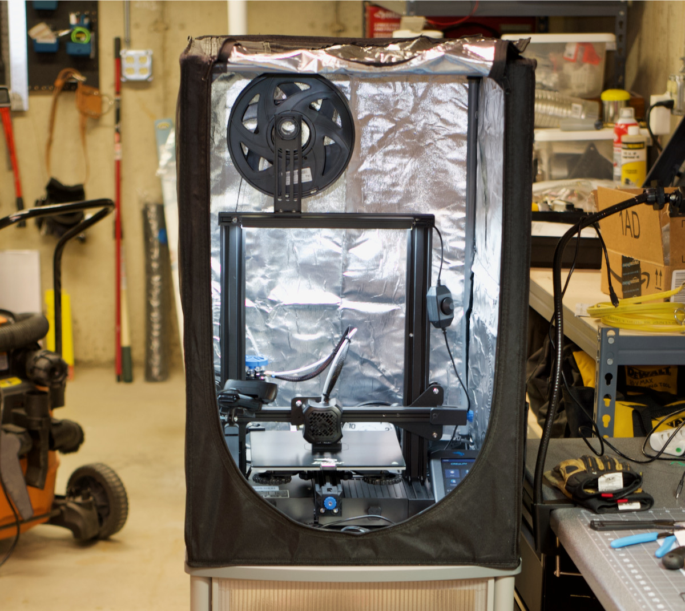
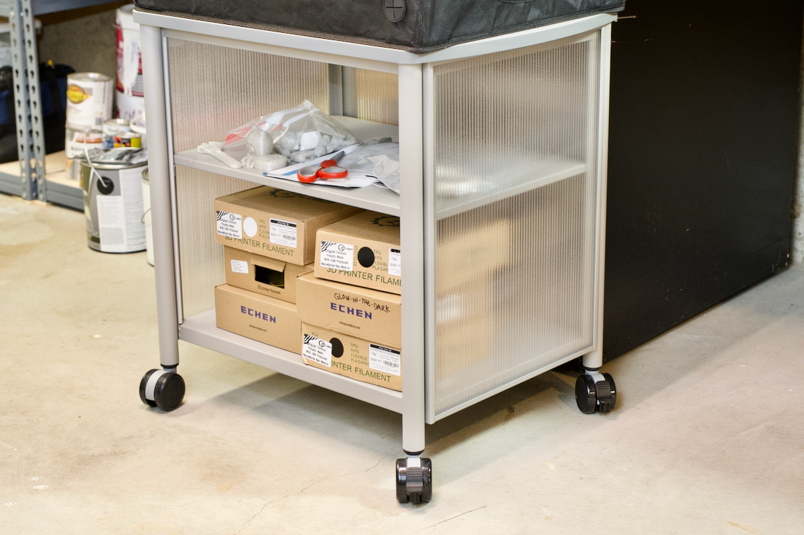
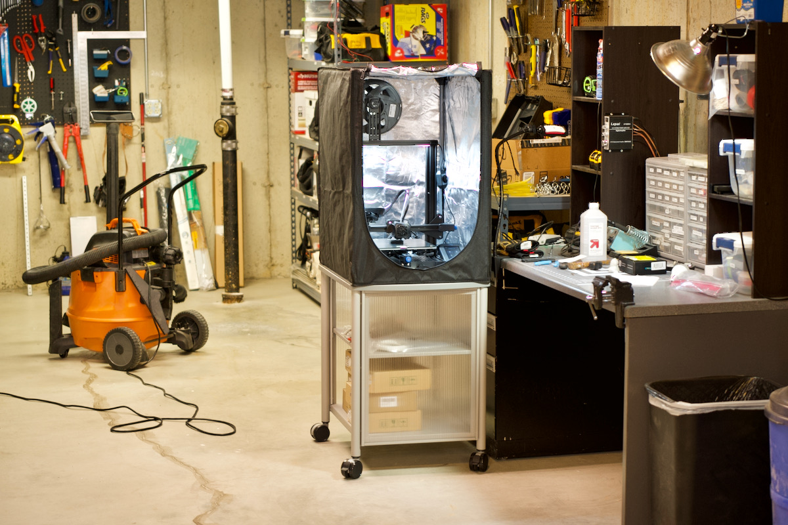
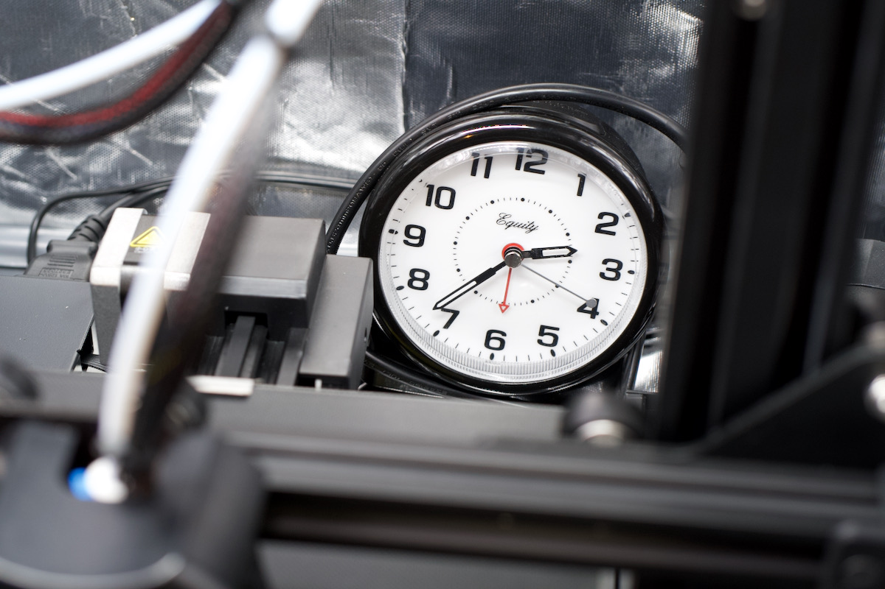
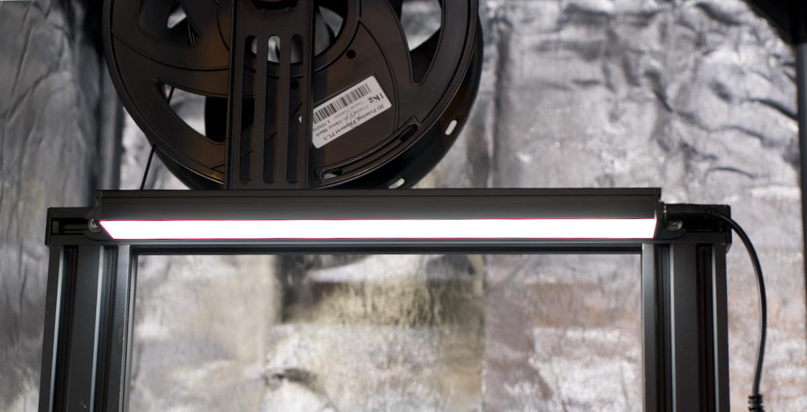
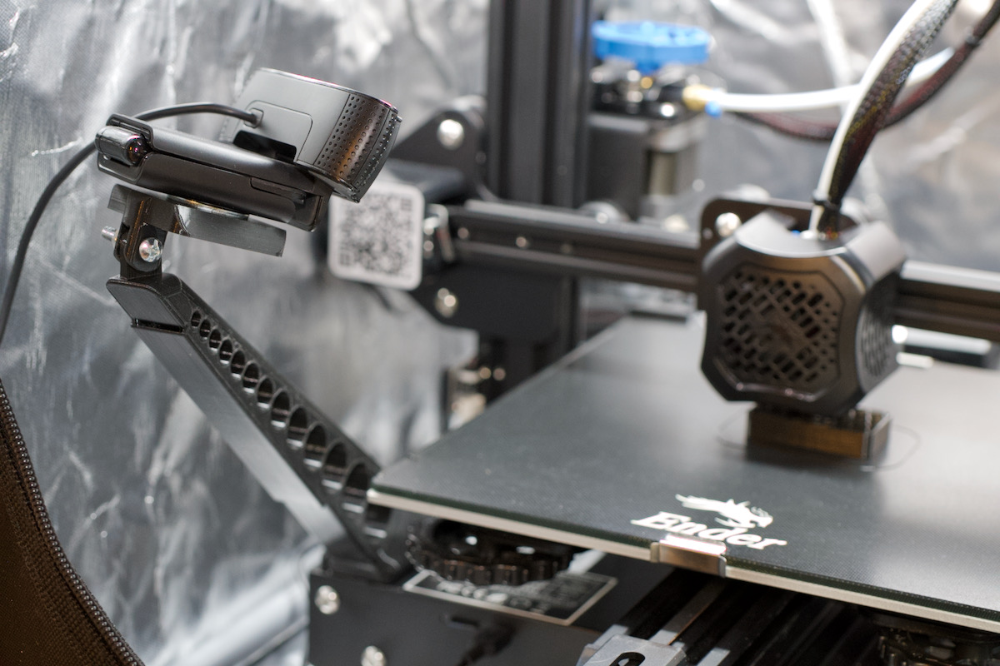
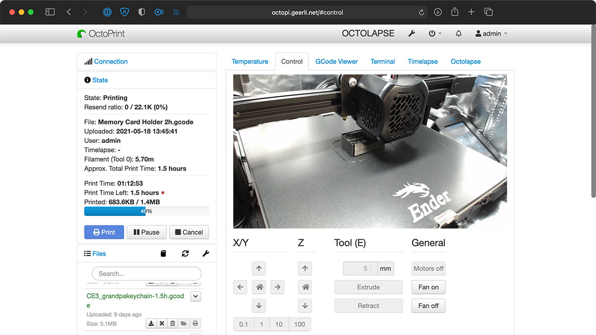
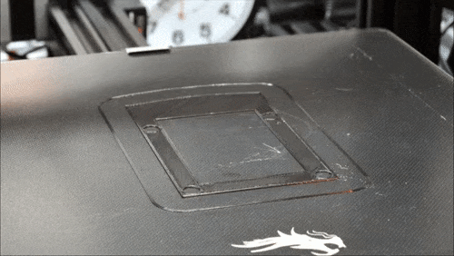

# Jeff Geerling's 3D Printing Setup

After spending many, many hours configuring things and adjusting my 3D Printing setup to my liking, I thought it would be a good idea to document everything here, not only for the benefit of others being able to learn from my setup, but also in case I need to replicate anything or a meteorite hits my printer and destroys it.

I just really like being able to replicate things, not only in 3D space, but also in terms of setting something up exactly the same in case it explodes.

## 3D Printer

<p align="center"></p>

I use an [Creality Ender 3 V2](https://amzn.to/3hBAbpE). It was recommended as being one of the best beginner-friendly low-cost printers, and so far it's lived up to that reputation.

It took a couple hours from unsealing the box to beginning my first print with the included white PLA filament, and only took a little adjustment before it was reliably printing objects.

### Printer Stand

<p align="center"></p>

I have my 3D Printer set up in my workshop, where I often need to move around large material (plywood sheets, etc.), and where there can be a lot of dust. So I wanted the printer to be easily movable yet still have a stable platform.

I decided to buy a rolling printer stand (specifically the [Safco Products Impromptu Mobile Print Stand 1857GR](https://amzn.to/341lOTb)) made for up to 200 lb of weight, since it would have good casters and be rigid enough to not affect 3D print quality. It also has enough shelving to hold all my extra filament and 3D Printer supplies.

I admit, I kinda splurged on the stand. But I figure it should be able to last a few decades—probably well past when my first 3D printer breaks down!

### Enclosure

<p align="center"></p>

I bought Creality's official [Fireproof and Dustproof Enclosure](https://amzn.to/3eVEGJB), because I operate my 3D Printer in my basement, where it can be drafty, and get down to 64°F (17.8°C) in the winter. The enclosure ensures more uniformity and helps with print bed adhesion.

It is a bit annoying working on things inside the enclosure sometimes (e.g. filament changes), but I can live with it.

### Analog clock

<p align="center"></p>

I placed an analog clock—specifically the [Equity by La Crosse](https://amzn.to/3frzxs3)—inside the enclosure in a place where cameras can see it in the background.

This makes timelapses and Octolapses (see the later sections) look more interesting, because it gives a clear visual indication of the passage of time.

Plus it reminds me that it's 2 a.m. and I need to go to bed instead of observe a 20-hour-long 3D print!

### LED Light

<p align="center"></p>

I bought a [Gulfcoast Robotics White LED kit](https://amzn.to/3eVXdpm) for my printer, as I wanted something low-profile but bright enough to make both photography and visibility easier.

If anything, I'd like the LED light to be even larger (more surface area) and stick out further to the front of the printer, just to give more even lighting... but I'm happy enough with the value and sleekness of this light—it looks like part of the printer.

One caveat: if you print to the maximum build volume height, the light may get in the way.

### Webcam Camera Arm

<p align="center"></p>

After finding OctoPrint, I decided I wanted to permanently mount my Logitech C920 webcam _inside_ the enclosure (instead of having it on a tripod outside the enclosure, looking through an open flap).

Looking through hundreds of options on Thingiverse, I settled on using Stewpercharged's [Ultimate Sturdy Octoprint Camera Mount](https://www.thingiverse.com/thing:3374914), but instead of mounting a Pi Camera to it, I designed a custom [Camera Tripod Mount Adapter](https://www.thingiverse.com/thing:4859975) for it, so I could screw my Logitech C920 on permanently.

I affixed the Tripod mount adapter to the arm using a #8 machine screw and nut, and then used a 1/4" Tripod screw (I had one in my [SmallRig Camera Screw set](https://amzn.to/33UOkGe)) to mount the Webcam to the adapter.

## OctoPrint

<p align="center"></p>

I found out about OctoPrint around the same time I decided to buy my 3D Printer. I had recently been made a 'GitHub Star', and in some conversation with another Star, [Gina Häußge](https://foosel.net), I discovered the wonderful ecosystem around OctoPrint, a free and open source 3D Printer web interface (and oh-so-much-more!).

I loved the app, the community, and especially the ability to run everything through Raspberry Pis.

So I set up a Raspberry Pi 4 model B inside an Argon One M.2 case (see [my review of that case](https://www.jeffgeerling.com/blog/2021/argon-one-m2-raspberry-pi-ssd-case-review)) with a built-in fan and an M.2 slot for a fast and large boot SSD.

I flashed the [OctoPi image](https://octoprint.org/download/) to the SSD, booted it up, and have been printing exclusively through OctoPrint since that day.

I live-streamed my [initial setup of OctoPrint](https://www.youtube.com/watch?v=Xx4s02w4kgA) over my Starlink Internet connection, but have learned a _lot_ about OctoPrint since that stream!

### OctoPrint Webcam preview

OctoPrint comes with built-in support for streaming a plugged in webcam or Pi Camera Module's output straight to your web browser, and it's really neat.

But to take it a step further, you'll want to customize at least the following:

#### Webcam options

If you're using a webcam like me (a Logitech C920), you should customize the streaming options inside `/boot/octopi.txt`:

```
camera_usb_options="-r 1280x720 -f 10"
```

You could use a higher resolution or framerate, but there are diminishing returns and it can bog down the Pi if you try to pump through too much data.

If you use an older Pi for OctoPrint, you may want to lower the resolution to 480p. And technically you could drop the framerate much lower if you just want to see what the printer's doing (and not sit mesmerized watching the print from afar, like I do).

#### Webcam manual focus and exposure

One thing that bothered me a lot until I found [this blog post](https://blog.ktz.me/disable-autofocus-in-octoprint-with-a-logitech-c920-webcam/) was the fact that the terrible autofocus on the Logitech C920 would never focus on the print, but rather on various uninteresting things like the back of the enclosure, or a speck of dust on the front of the print bed.

To use manual autofocus and exposure, you can use `v4l2-ctl`. To make these changes automated so they apply every time you reboot the Pi running OctoPrint, add the following configuration to the file `~/.octoprint/config.yaml`:

```yaml
events:
  subscriptions:
  - command:
    # Disable autofocus.
    - v4l2-ctl --set-ctrl=focus_auto=0
    # Set focus value to range 1-255 (255 being extreme closeup).
    - v4l2-ctl --set-ctrl=focus_absolute=22
    # Disable autoexposure.
    - v4l2-ctl --set-ctrl=exposure_auto=1
    # Set an absolute value for exposure (10000 = 1 second).
    - v4l2-ctl --set-ctrl=exposure_absolute=170
    event: Startup
    type: system
```

After you reboot, these four commands should be run, and OctoPrint will reformat the `config.yaml` file, likely removing the inline comments.

If you require a password to be entered for `sudo` use as the `pi` user, you will also need to add a file named `/etc/sudoers.d/octoprint-v4l2`, and put the following inside:

```
pi ALL=NOPASSWD: /usr/bin/v4l2-ctl
```

### Octolapse and Nikon D700

<p align="center"></p>

I have an old Nikon D700 (one of my favorite cameras of all time), with a Nikon 60mm AF-D Macro lens, and it is perfect for a time-lapse camera, as it can be remote controlled over USB, and works with the [Octolapse plugin](https://plugins.octoprint.org/plugins/octolapse/).

I set the camera in full manual (including manual focus), and here's a blog post discussing how I set it up to work with Octolapse to create beautiful time-lapses of my prints: [Beautiful 3D Print time-lapses with my Nikon D700 and Octolapse](https://www.jeffgeerling.com/blog/2021/beautiful-3d-print-time-lapses-my-nikon-d700-and-octolapse).

### OctoText

I wanted to know when my prints finished, and didn't want to download an entire app to my phone or use any sort of cloud service.

Luckily, there's a plugin called [OctoText](https://plugins.octoprint.org/plugins/OctoText/) that just requires SMTP credentials, and will send an email to an [email-to-SMS gateway](https://www.liquisearch.com/list_of_sms_gateways) address so you can get texts from OctoPrint!

I set it up with an app-specific SMTP credential from FastMail, and then configured OctoText to send me a text when the print completes.

## Author

This repository is maintained by [Jeff Geerling](https://www.jeffgeerling.com).
